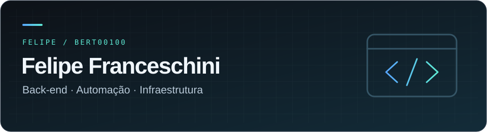

  

  <strong>Desenvolvedor Back-end Python · São Paulo, Brasil</strong> 
  Transformo rotinas manuais em sistemas, integrações e automações.

  <a href="https://www.linkedin.com/in/felipefranceschini/">LinkedIn</a> ·
  <a href="mailto:felipebertoncinifranceschini@gmail.com">E-mail</a> ·
  <a href="#projetos-em-destaque">Projetos</a> ·
  <a href="#atividade-no-github">Atividade</a>

## Sobre mim

Sou Felipe Franceschini. Minha trajetória começou em TI e automação operacional e evoluiu para o desenvolvimento back-end, conectando **software, dados e infraestrutura**.

Trabalho com **Python, FastAPI, SQLAlchemy e PostgreSQL**, desenvolvendo APIs, integrações e ferramentas que resolvem problemas do dia a dia. Tenho experiência com arquitetura multi-tenant, otimização de consultas SQL e operação de aplicações em Linux e Docker.

Também desenvolvo projetos open source e exploro IA aplicada com RAG e modelos locais.

## Da ideia à operação

- **Automação:** ferramenta em Python que reduziu a configuração de máquinas de **40 para 20 minutos**.
- **Monitoramento:** criação do HawkDot, adotado pela Mettric Tecnologia, com redução do tempo de resposta a incidentes de **5 para 2 minutos**.
- **Back-end:** implementação de arquitetura **multi-tenant**, com isolamento de dados e integração entre sistemas.

## Tecnologias

| Área | Ferramentas e práticas |
| :--- | :--- |
| **Back-end** | Python · FastAPI · SQLAlchemy · APIs REST · Webhooks |
| **Dados** | PostgreSQL · MySQL · SQLite · Modelagem · Otimização de SQL |
| **Ecossistema web** | TypeScript · JavaScript · Node.js · Prisma |
| **Infraestrutura** | Linux · Docker · Git · GitLab CI/CD · VPS · Proxmox · WireGuard |
| **IA aplicada** | RAG · LangChain · Ollama · ChromaDB |

## Projetos em destaque

### [HawkDot ↗](https://github.com/Bert00100/hawkdot)

**Monitoramento de infraestrutura, do incidente ao alerta.** Plataforma self-hosted para acompanhar endpoints HTTP, certificados SSL e conectividade, com histórico de eventos e notificações via Telegram e webhooks. Inclui isolamento multi-tenant com PostgreSQL e controle de acesso por papéis.

`TypeScript` `Node.js` `PostgreSQL` `Prisma` `Docker`

### [base-scraping ↗](https://github.com/Bert00100/base-scraping)

**Da busca por empresas a uma base B2B validada.** Pipeline em Python para descoberta, validação cadastral e enriquecimento de empresas brasileiras. Organiza a coleta em etapas independentes, com rastreabilidade por campo, pontuação de qualidade e checkpoints em SQLite.

`Python` `SQLite` `APIs` `Web scraping` `CLI`

### Assistente de IA local

**Documentação do produto acessível em linguagem natural.** Projeto desenvolvido na Mettric Tecnologia para responder dúvidas sobre o Mettric Agenda. Utiliza RAG para recuperar trechos da documentação e gerar respostas em streaming, com execução local dos modelos.

`Python` `FastAPI` `LangChain` `Ollama` `ChromaDB`

Projeto profissional; código não disponibilizado neste perfil.

[Explorar todos os repositórios →](https://github.com/Bert00100?tab=repositories)

## Atividade no GitHub

  
  

Dados públicos com atualização diária. Commits: ano corrente. Linguagens: distribuição de código, não nível de domínio. Atividades no GitLab e em repositórios privados não estão representadas.

[Ver histórico de contribuições →](https://github.com/Bert00100?tab=overview)

## Formação

**Análise e Desenvolvimento de Sistemas** · Universidade Cruzeiro do Sul · 2025 
**Técnico em Tecnologia da Informação** · Senac Aclimação · 2022

---

Tem um projeto de back-end, automação ou integração para conversar? 
**[Vamos conversar no LinkedIn](https://www.linkedin.com/in/felipefranceschini/)** ou por [e-mail](mailto:felipebertoncinifranceschini@gmail.com).
